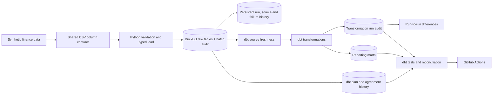

# Finance Analytics Engineering Portfolio

[](https://github.com/Wasim-Jussab/finance-analytics-engineering-portfolio/actions/workflows/quality-checks.yml)

A local finance data pipeline built with Python, DuckDB and dbt Core. It generates synthetic customer, loan, subscription and payment data, loads typed raw tables, builds reporting models and checks the outputs through data tests and reconciliation controls.

I am building this project to make my move from data analysis into analytics engineering visible without publishing employer data. The business problems are familiar to me; the dbt structure, automated testing and engineering workflow are the areas I am practising publicly.

## Current pipeline



Everything runs locally with no cloud account, credentials or paid service.

## Thirty-day checkpoint

The first milestone is complete. It now covers reproducible synthetic data,
contract-checked atomic ingestion, dbt dimensional and historical models,
incremental payment handling, reconciliation, run evidence and CI. The honest
technical assessment—including what this project does not prove—is in the
[30-day review](docs/30-day-review.md).

## What is implemented

| Area | Current implementation |
|---|---|
| Data generation | Deterministic customers, loans, principal-only repayment schedules, subscription plans, agreements and payment attempts using a fixed seed |
| Ingestion | Python validates a shared CSV column contract, loads typed DuckDB tables atomically, fingerprints accepted files and records failures |
| Transformation | dbt materialises reporting models in `mart`, builds month-end loan snapshots, uses a keyed incremental merge for subscription payments, retains reconciled run outcomes and run-to-run changes, keeps observed plan and agreement versions, and combines status changes and source removals without erasing their meaning |
| Data quality | Key, relationship, required-field, accepted-value, chronology, history-window and current-state reconciliation tests |
| Financial control | Loan payments and subscription collections reconcile to source; billed amounts agree with the governed synthetic plan catalogue |
| Documentation | dbt source/model descriptions, architecture notes, data contract and daily decision log |
| Automation | GitHub Actions reruns source freshness, the dbt build, Python tests and linting |

## Reporting models

| Model | Grain | Important logic |
|---|---|---|
| `mart.dim_customer` | One row per customer | Combines customer attributes into a reporting dimension |
| `mart.dim_date` | One row per calendar date | Provides tested calendar, month, quarter and weekend attributes |
| `mart.dim_loan` | One row per loan account | Adds completed-payment count, value and latest completed-payment date |
| `mart.dim_subscription_plan` | One row per product and billing frequency | Holds the current synthetic billing amount used by agreements and payment controls |
| `history.subscription_plan_history` | One row per observed plan version | Closes an old version when dbt detects a change to product, frequency or amount |
| `history.subscription_agreement_history` | One row per observed agreement version | Preserves detected plan, status and cancellation changes without replacing the prior state |
| `mart.fct_subscription_status_change` | One row per observed agreement status transition | Compares consecutive snapshot versions and keeps business-event and observation dates separate |
| `mart.fct_subscription_source_removal` | One row per agreement missing from the current source | Retains the last observed state without labelling source absence as cancellation |
| `mart.fct_subscription_history_event` | One row per observed status change or source removal | Gives downstream reporting one event grain while preserving the distinction between business change and source absence |
| `mart.dim_subscription` | One row per subscription agreement | Adds cancellation date, current status and completed active months |
| `mart.fct_payment` | One row per payment attempt | Retains successful and failed attempts and derives a success flag |
| `mart.fct_loan_monthly_snapshot` | One row per loan account and completed calendar month | Retains monthly and cumulative completed payments plus a clearly labelled remaining-balance calculation |
| `mart.fct_loan_repayment_schedule` | One row per loan account and scheduled instalment | Holds explicit principal due dates and amounts that reconcile to each synthetic loan's original balance |
| `mart.fct_subscription_payment` | One row per subscription billing attempt | Incrementally merges stable keys, retains source-absent rows as evidence and excludes them from current reporting |
| `audit.audit_subscription_payment_run` | One row per selected dbt invocation | Retains raw, physical, current, absent and collection reconciliation metrics for each payment-fact run |
| `audit.subscription_payment_run_delta` | One row per recorded payment run | Compares the current and preceding run; first-run differences are null because no earlier run exists |
| `mart.agg_subscription_monthly` | One row per eligible month, product and billing frequency | Adds active-agreement context and explicit zeros where an active plan has no billing attempt |
| `mart.agg_subscription_movement_monthly` | One row per month, product and billing frequency | Reconciles opening population, starts, cancellations, net movement and closing population |

Failed payments are deliberately retained. Filtering them out during transformation would make the reporting totals look cleaner while removing useful operational evidence.

## Validation evidence

The current seed-42 run produced:

| Check | Result |
|---|---:|
| Customers | 25 |
| Loans | 25 |
| Scheduled loan instalments | 294 / £68,350.00 principal |
| Synthetic loan terms | 9 six-month / 8 twelve-month / 8 eighteen-month |
| Subscription plans | 4 |
| Subscriptions | 20 |
| Loan payment attempts | 99 |
| Loan month-end snapshot rows | 355 across 25 accounts |
| Calculated remaining balance at 31 December 2025 | £62,325.00 |
| Subscription billing attempts | 150 |
| Completed subscription collections | 125 / £3,648.00 |
| Monthly aggregate rows | 82 |
| Zero-activity plan months | 28 |
| Agreement-movement rows | 83 |
| Agreement starts / cancellations | 20 / 6 |
| December closing agreements | 14 |
| Calendar dates | 731 |
| Audited source records | 8 |
| Fingerprinted CSV sources | 7 of 7 |
| Successful run/source history rows | 1 / 8 |
| Failed run/failure detail rows | 0 / 0 |
| dbt table models | 13 passed |
| Clean transformation audit rows | 1 reconciled |
| dbt incremental models | 2 passed |
| dbt run-difference views | 1 passed |
| dbt snapshots | 2 passed |
| Clean plan-history versions | 4 current / 0 closed |
| Clean agreement-history versions | 20 current / 0 closed |
| Clean observed status changes | 0 |
| Clean source removals | 0 |
| Clean unified history events | 0 |
| dbt data tests | 275 passed |
| dbt model, snapshot and data-test resources | 293 passed |
| DuckDB checkpoint hook | Passed |
| Total dbt results including hook | 294 passed |
| Raw sources within freshness threshold | 9 of 9 |
| Python tests | 24 passed |
| Ruff | Passed |

Controlled failure checks have detected invalid values, broken chronology, duplicate grains, missing calendar and reporting rows, payment-to-plan disagreement, an incorrect agreement closing balance, a mismatched ingestion count, inconsistent run history and CSV schema drift. A separate temporary-database scenario changed one synthetic plan by £0.01 and produced five plan-history versions: four current and one closed. A second scenario cancelled one active synthetic agreement and produced 21 agreement-history versions—20 current and one closed—plus exactly one Active-to-Cancelled status-change fact row. A third scenario removed one active source row and created one separate removal record while retaining its last observed Active status. The status and removal scenarios also each rebuilt and tested the unified event feed: one `Status Change` event in the first and one `Source Removal` event in the second. The incremental-payment scenario proved unchanged reruns, one late insert, one in-place correction and no duplicate keys. It then removed one completed source row: the fact retained the key once with an absence timestamp, current monthly metrics excluded it, and restoring the source row reversed the flag without duplication. The same six builds appended six distinct transformation-audit rows, each reconciling the raw snapshot to physical, current and collected fact metrics. Missing-file and renamed-column tests also prove that an incomplete replacement leaves the preceding valid batch in place and records a sanitised failure separately.

For the same six runs, the comparison view shows zero movement on unchanged reruns, increased collections after a correction, a retained absent key when a payment leaves the source, and the reverse movement when it returns. These are net totals, not explanations of individual payment events.

The full evidence and remaining limitations are recorded in [docs/validation.md](docs/validation.md). The operating sequence and failure response are in the [historical modelling runbook](docs/history-runbook.md).

## Run locally

Requirements: Python 3.11 or later.

```bash
git clone https://github.com/Wasim-Jussab/finance-analytics-engineering-portfolio.git
cd finance-analytics-engineering-portfolio
python -m pip install -e ".[dev]"
make pipeline
make check
make verify
```

Useful individual commands:

```bash
make generate
make load
make dbt-debug
make dbt-freshness
make dbt-build
make snapshot-history-check
make subscription-history-check
make subscription-removal-check
make incremental-payment-check
make dbt-docs
```

`make verify` is the merge gate used by GitHub Actions. It generates and loads a
fresh dataset, checks source freshness, builds every dbt resource, runs all four
controlled change scenarios, executes Python tests and linting, and generates the
dbt catalogue.

Generated CSVs, DuckDB files, dbt output and logs are excluded from Git.

## Design decisions

- **Synthetic data only:** no employer records, customer identifiers or confidential business rules are used.
- **Explicit grain:** customer, loan and payment models have documented keys and relationship tests.
- **Fixed reporting date:** loan age uses a supplied as-of date rather than the machine clock.
- **Calculated balance is labelled honestly:** the monthly loan snapshot subtracts completed payments from original balance and floors the result at zero. It is not presented as a contractual statement balance because it does not allocate payments to the new schedule and the source has no interest allocation, fees or adjustments.
- **Schedule assumptions are visible:** each synthetic loan has a stated 6-, 12- or 18-month term and monthly principal instalments. The final instalment absorbs penny rounding so the schedule reconciles exactly to original balance. Interest, fees and arrears are not inferred.
- **Decimal money types:** monetary fields are loaded as controlled decimal values.
- **Raw and mart separation:** source data is kept separate from reporting transformations.
- **Reconciliation before presentation:** completed-payment values are compared at raw, fact and account-summary level.
- **Separate agreement and event grains:** subscription attributes remain in the dimension while billing attempts have their own fact table.
- **Governed synthetic pricing:** agreements reference a four-row plan catalogue, and every billed amount is tested against it. The values were invented for this project and do not represent an employer's pricing.
- **Observed plan history:** a dbt check snapshot versions plan-definition changes. Ingestion fields are excluded from change detection so an unchanged reload does not create false history.
- **Event time is separate from observation time:** agreement snapshots retain detected status changes, while `cancellation_date` remains the synthetic business event date. dbt validity timestamps only show when the pipeline saw a version.
- **No manufactured baseline history:** the clean status-change fact is empty because an initial snapshot is a state, not a transition. A row appears only after two observed versions have different statuses.
- **Source absence is not cancellation:** an invalidated snapshot version is reported separately from a business status transition. A missing extract row does not prove that an agreement was cancelled.
- **One event grain, explicit meanings:** status changes and source removals can share a reporting feed, but `event_type`, status fields and business-event dates keep their semantics distinct.
- **Incremental by stable business key:** subscription payment attempts merge on `subscription_payment_id`, so late keys are inserted and corrected source rows update in place without duplicating an attempt.
- **Source absence is retained, not guessed:** a payment missing from the latest snapshot remains in the fact with an observation timestamp, but current collection reporting excludes it. Reappearance restores the current flag. Absence is not labelled as a business deletion.
- **Run outcomes are retained:** each selected payment-fact invocation appends its raw, physical, current, absent and collection counts under the dbt invocation ID, so a stable rerun and a changed run leave separate evidence.
- **Differences are not explanations:** a view compares consecutive audited populations and collection totals. A zero net difference does not prove that no individual row changed.
- **Outcome audit is not row-level lineage:** the run record proves the resulting populations and totals reconcile; it does not claim to identify every inserted or updated key.
- **No false performance claim:** the current raw load is still full refresh, so the incremental fact reads the complete small source. This step proves safe merge and rerun behaviour, not reduced source scanning.
- **Collections are not revenue:** a completed synthetic billing attempt supports a cash-collected measure, but revenue recognition remains out of scope.
- **Aggregate grain is explicit:** monthly performance is grouped by billing month, product and billing frequency, with a compound-grain test.
- **Collection rate is attempt-based:** completed attempts are divided by all attempts; this is not an amount-weighted recovery rate.
- **Calendar range is controlled:** the date dimension starts from a dbt variable and ends at the fixed reporting date, with bounds and continuity tests.
- **Zeros have a defined population:** the monthly mart includes a plan only when at least one related agreement overlaps that month; it does not cross join every plan to every date.
- **Movement balances roll forward:** each month's closing agreement count reconciles to opening population plus starts less cancellations, and becomes the next month's opening count.
- **Freshness uses ingestion time:** every raw row receives the timestamp of the batch that loaded it; source event dates are not misused as arrival metadata.
- **One auditable load batch:** every raw table shares one generated `load_id`, while the audit table records each expected source, row count, status and timestamp.
- **Atomic replacement:** raw loading, the retained SQL comparison models and ingestion validation run in one transaction; a missing source rolls the whole attempt back.
- **Successful history is retained:** committed runs and their source records append to a separate `audit` schema instead of disappearing with the next full refresh.
- **Files are fingerprinted:** each CSV records its byte size and SHA-256 digest, allowing identical and changed inputs to be distinguished without storing a second copy.
- **Failure logging is separate from data replacement:** a rejected load rolls back the raw-table transaction first, then writes a small failure record in its own control transaction so a bad batch cannot become current data.
- **Failure details are limited:** the audit stores the exception type and a sanitised message; missing-file errors retain the filename but not the local filesystem path.
- **One executable source contract:** generation and ingestion share the expected CSV columns and DuckDB types, preventing two separate definitions from drifting unnoticed.
- **Header order is not a contract:** missing, unexpected and duplicate column names fail the load, but harmless column reordering is accepted because ingestion maps values by name.
- **Local recovery is constrained:** a DuckDB-only end-of-run hook requests a forced checkpoint. If the known duplicate-schema WAL replay error still occurs, controlled scenarios copy the checkpointed database without deleting the recovery file; unrelated catalogue errors still fail.
- **One merge gate:** local verification and GitHub Actions use the same `make verify` entry point, reducing the chance that CI and the documented workflow silently diverge.

## Known gaps

This is a working project, not a finished platform.

- Only the subscription-payment fact is incremental. The other marts rebuild as tables, and the full-refresh raw source means the merge still considers every payment row.
- Payment absence is observed from complete source snapshots. Without an upstream deletion event or reason code, the model cannot distinguish a genuine deletion from an omitted extract row.
- Subscription refunds, retries, plan changes and revenue-recognition rules are not modelled.
- Plan history starts when dbt first observes a change; the source still has no contractual business-effective date, so earlier pricing cannot be reconstructed.
- The agreement data has no pause, reactivation or status-history events; the movement mart uses only start and cancellation dates.
- The calendar start date is configuration rather than source-system metadata.
- `loaded_at` records the local DuckDB load, not the extraction time of an upstream production system.
- The audit currently treats an empty source as invalid and has no upstream extract ID.
- Failed attempts retain only run-level error metadata; they do not have source-level fingerprints because the batch was not accepted.
- The audit history and analytical data share one local DuckDB file, so the control record is evidence for this workflow rather than an immutable external log.
- The transformation-run audit is written only when its downstream model is selected. It has no independent alerting, external control store or protection from someone with write access to the local database.
- The source contract checks column presence but is not versioned and does not yet define nullable fields or source-specific empty-file policies.
- The dataset is intentionally small and has not been performance-tested.
- The repayment schedule is principal-only synthetic contract data. It has no interest split, fees, grace period, reschedule events or allocation rules, so the project still cannot claim lender-grade arrears, days-past-due or accounting balances.
- The cloud architecture is documented as a possible production mapping, not presented as a deployed AWS system.

## Repository map

```text
config/                 Local dbt profile with no credentials
docs/                   Architecture, data contract, workflow and validation evidence
models/                 dbt sources and reporting models
snapshots/              dbt SCD Type 2 history definitions
notes/                  Daily learning and decision log
src/finance_portfolio/  Python generation and loading code
sql/duckdb/             Earlier SQL implementation retained for comparison
tests/                   Python and dbt data tests
.github/workflows/       Automated quality checks
```

## Project notes

The daily notes record what changed, what failed and what remains unresolved. They are intentionally more candid than the main README.

- [Day 1: foundation and initial data contract](notes/day-01.md)
- [Day 2: deterministic synthetic data](notes/day-02.md)
- [Day 3: first reporting layer](notes/day-03.md)
- [Day 4: DuckDB ingestion and SQL marts](notes/day-04.md)
- [Day 5: first dbt models](notes/day-05.md)
- [Day 6: end-to-end dbt run](notes/day-06.md)
- [Day 7: stronger data-quality checks](notes/day-07.md)
- [Day 8: public milestone review](notes/day-08.md)
- [Day 9: subscription modelling without invented revenue](notes/day-09.md)
- [Day 10: subscription billing events and controls](notes/day-10.md)
- [Day 11: monthly subscription performance](notes/day-11.md)
- [Day 12: tested date dimension](notes/day-12.md)
- [Day 13: governed subscription plans](notes/day-13.md)
- [Day 14: zero-activity monthly reporting](notes/day-14.md)
- [Day 15: monthly agreement movement](notes/day-15.md)
- [Day 16: source freshness from ingestion metadata](notes/day-16.md)
- [Day 17: atomic and auditable batch loading](notes/day-17.md)
- [Day 18: persistent run history and source fingerprints](notes/day-18.md)
- [Day 19: retaining failed ingestion attempts](notes/day-19.md)
- [Day 20: enforcing the CSV column contract](notes/day-20.md)
- [Day 21: observed subscription plan history](notes/day-21.md)
- [Day 22: agreement status history and event time](notes/day-22.md)
- [Day 23: deriving observed status changes](notes/day-23.md)
- [Day 24: separating source removal from cancellation](notes/day-24.md)
- [Day 25: one event feed without flattening the meaning](notes/day-25.md)
- [Day 26: incremental payment merges and safe reruns](notes/day-26.md)
- [Day 27: retaining source-absent payments safely](notes/day-27.md)
- [Day 28: retaining evidence for each incremental run](notes/day-28.md)
- [Day 29: comparing consecutive payment runs](notes/day-29.md)
- [Day 30: closing the first milestone](notes/day-30.md)
- [Day 31: first month-end loan snapshot](notes/day-31.md)
- [Day 32: explicit loan repayment schedule](notes/day-32.md)

This repository demonstrates how I structure and validate analytics-engineering work. My production experience with Redshift, AWS Glue/Python, Power BI, regulatory reporting and financial reconciliations is described separately in my professional profile.
