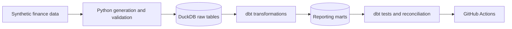

# Finance Analytics Engineering Portfolio

[](https://github.com/Wasim-Jussab/finance-analytics-engineering-portfolio/actions/workflows/quality-checks.yml)

A local finance data pipeline built with Python, DuckDB and dbt Core. It generates synthetic customer, loan, subscription and payment data, loads typed raw tables, builds reporting models and checks the outputs through data tests and reconciliation controls.

I am building this project to make my move from data analysis into analytics engineering visible without publishing employer data. The business problems are familiar to me; the dbt structure, automated testing and engineering workflow are the areas I am practising publicly.

## Current pipeline



Everything runs locally with no cloud account, credentials or paid service.

## What is implemented

| Area | Current implementation |
|---|---|
| Data generation | Deterministic customers, loans, subscriptions and payment attempts using a fixed seed |
| Ingestion | Python loader creates typed DuckDB tables in the `raw` schema |
| Transformation | dbt materialises customer, loan, subscription and payment models in the `mart` schema |
| Data quality | Key, relationship, required-field, accepted-value and chronology tests |
| Financial control | Completed-payment totals reconcile across raw payments, the payment fact and loan summaries |
| Documentation | dbt source/model descriptions, architecture notes, data contract and daily decision log |
| Automation | GitHub Actions reruns the local pipeline, Python tests and linting |

## Reporting models

| Model | Grain | Important logic |
|---|---|---|
| `mart.dim_customer` | One row per customer | Combines customer attributes into a reporting dimension |
| `mart.dim_loan` | One row per loan account | Adds completed-payment count, value and latest completed-payment date |
| `mart.dim_subscription` | One row per subscription agreement | Adds status, billing frequency and completed months since start |
| `mart.fct_payment` | One row per payment attempt | Retains successful and failed attempts and derives a success flag |

Failed payments are deliberately retained. Filtering them out during transformation would make the reporting totals look cleaner while removing useful operational evidence.

## Validation evidence

The current seed-42 run produced:

| Check | Result |
|---|---:|
| Customers | 25 |
| Loans | 25 |
| Subscriptions | 20 |
| Payment attempts | 99 |
| dbt models | 4 passed |
| dbt data tests | 46 passed |
| Total dbt resources | 50 passed |
| Python tests | 9 passed |
| Ruff | Passed |

Controlled failure checks have detected both an invalid payment status and a subscription start date after the reporting date. Each test returned exactly one offending row and a non-zero exit code before the clean model was rebuilt.

The full evidence and remaining limitations are recorded in [docs/validation.md](docs/validation.md).

## Run locally

Requirements: Python 3.11 or later.

```bash
git clone https://github.com/Wasim-Jussab/finance-analytics-engineering-portfolio.git
cd finance-analytics-engineering-portfolio
python -m pip install -e ".[dev]"
make pipeline
make check
```

Useful individual commands:

```bash
make generate
make load
make dbt-debug
make dbt-build
make dbt-docs
```

Generated CSVs, DuckDB files, dbt output and logs are excluded from Git.

## Design decisions

- **Synthetic data only:** no employer records, customer identifiers or confidential business rules are used.
- **Explicit grain:** customer, loan and payment models have documented keys and relationship tests.
- **Fixed reporting date:** loan age uses a supplied as-of date rather than the machine clock.
- **Decimal money types:** monetary fields are loaded as controlled decimal values.
- **Raw and mart separation:** source data is kept separate from reporting transformations.
- **Reconciliation before presentation:** completed-payment values are compared at raw, fact and account-summary level.
- **No inferred subscription revenue:** billing frequency is descriptive; revenue is deferred until price and billing-event data exist.
- **No false freshness claim:** source freshness is deferred because the raw tables do not yet contain a genuine ingestion timestamp.

## Known gaps

This is a working project, not a finished platform.

- The models currently rebuild as tables rather than incrementally.
- Subscription billing events and revenue measures do not exist yet.
- Source freshness needs real ingestion metadata.
- The dataset is intentionally small and has not been performance-tested.
- The cloud architecture is documented as a possible production mapping, not presented as a deployed AWS system.

## Repository map

```text
config/                 Local dbt profile with no credentials
docs/                   Architecture, data contract, workflow and validation evidence
models/                 dbt sources and reporting models
notes/                  Daily learning and decision log
src/finance_portfolio/  Python generation and loading code
sql/duckdb/             Earlier SQL implementation retained for comparison
tests/                   Python and dbt data tests
.github/workflows/       Automated quality checks
```

## Project notes

The daily notes record what changed, what failed and what remains unresolved. They are intentionally more candid than the main README.

- [Day 1: foundation and initial data contract](notes/day-01.md)
- [Day 2: deterministic synthetic data](notes/day-02.md)
- [Day 3: first reporting layer](notes/day-03.md)
- [Day 4: DuckDB ingestion and SQL marts](notes/day-04.md)
- [Day 5: first dbt models](notes/day-05.md)
- [Day 6: end-to-end dbt run](notes/day-06.md)
- [Day 7: stronger data-quality checks](notes/day-07.md)
- [Day 8: public milestone review](notes/day-08.md)
- [Day 9: subscription modelling without invented revenue](notes/day-09.md)

This repository demonstrates how I structure and validate analytics-engineering work. My production experience with Redshift, AWS Glue/Python, Power BI, regulatory reporting and financial reconciliations is described separately in my professional profile.
