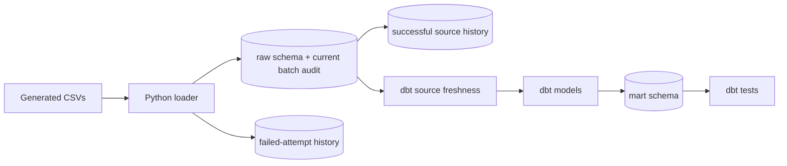

# dbt workflow

## What dbt is doing here

The Python loader creates the raw DuckDB tables. dbt then owns the SQL that turns those tables into the reporting models.

The database path is deliberately passed through `FINANCE_DUCKDB_PATH`. This matters because the loader and dbt must point to the same file; otherwise dbt can connect successfully but still report that the raw schema does not exist.



## Run sequence

From the repository root:

```bash
python -m pip install -e ".[dev]"
PYTHONPATH=src python -m finance_portfolio.generate_data
PYTHONPATH=src python -m finance_portfolio.load_duckdb
FINANCE_DUCKDB_PATH=data/finance.duckdb dbt debug --project-dir . --profiles-dir config
FINANCE_DUCKDB_PATH=data/finance.duckdb dbt source freshness --project-dir . --profiles-dir config --target local --no-partial-parse
FINANCE_DUCKDB_PATH=data/finance.duckdb dbt build --project-dir . --profiles-dir config --target local --no-partial-parse
```

`dbt build` materialises the nine mart models and runs the model tests and singular controls. The `--no-partial-parse` option is useful while changing the project because it makes the command parse the files currently on disk.

`dbt source freshness` is a separate operational check. It runs after the raw load and before transformation. All eight sources, including the ingestion audit, use the batch `loaded_at` timestamp rather than a business event date, with a one-hour warning and a 24-hour error threshold.

The local DuckDB target requests a forced checkpoint at the end of dbt commands. This was added after a completed build left a recovery file that conflicted with the next connection. The conflict has still recurred after a later full build, so the hook is treated as a mitigation rather than a guarantee. It is adapter-specific and does not represent a warehouse-wide production pattern.

To generate the local documentation site:

```bash
FINANCE_DUCKDB_PATH=data/finance.duckdb dbt docs generate --project-dir . --profiles-dir config --target local --no-partial-parse
```

The generated `target/` directory is local output and is not committed.

## Models and checks

| Model | Grain | Main checks |
|---|---|---|
| `dim_date` | One row per calendar date | Date/key uniqueness, valid attributes, configured bounds and uninterrupted daily sequence |
| `dim_customer` | One row per customer | Customer key not null and unique |
| `dim_loan` | One row per loan account | Account key not null and unique; customer relationship |
| `dim_subscription_plan` | One row per product and billing frequency | Plan key, compound grain, accepted values, positive amount and source reconciliation |
| `dim_subscription` | One row per subscription agreement | Subscription key, customer relationship, accepted values, chronology and row-count reconciliation |
| `fct_payment` | One row per payment | Payment key not null and unique; account relationship |
| `fct_subscription_payment` | One row per subscription billing attempt | Payment key, subscription relationship, accepted values, chronology, positive amount and collection reconciliation |
| `agg_subscription_monthly` | One row per eligible month, product and billing frequency | Active-plan coverage, compound grain, zero handling, metric consistency and fact reconciliation |
| `agg_subscription_movement_monthly` | One row per month, product and billing frequency | Complete month coverage, movement equation, roll-forward and agreement reconciliation |

The singular test `reconcile_completed_payments` compares completed-payment totals in three places:

1. `raw.payments`
2. `mart.fct_payment`
3. The completed-payment summary in `mart.dim_loan`

This is a deliberately small control, but it reflects the type of check I would want before allowing a financial reporting model to be consumed.

`reconcile_subscription_row_count` confirms that the agreement-level mart has not silently lost or multiplied source rows. `subscription_start_not_after_as_of_date` prevents a future-starting agreement from appearing in a model described as being valid at the fixed run date.

`reconcile_subscription_collections` compares completed billing amounts in the raw event table with the fact table. The cancellation and billing-date tests also check that an active agreement has no cancellation date and that no attempt falls outside its agreement dates.

`reconcile_subscription_monthly` proves that the reporting aggregate preserves attempt counts and monetary totals from `fct_subscription_payment`. Separate controls test the compound grain and internal count/rate logic.

`date_dimension_bounds` checks the configured start, fixed end and expected number of dates. `date_dimension_continuity` uses the previous date in sequence to detect gaps inside those bounds. Billing fact and monthly aggregate relationship tests confirm that both daily and month-start dates resolve to the calendar.

`subscription_agreement_matches_plan` checks that the product and billing frequency retained on each agreement agree with its referenced plan. `subscription_payment_matches_plan_amount` follows the agreement-to-plan relationship and rejects billing attempts with a different amount.

`subscription_monthly_active_plan_coverage` independently rebuilds the agreement-overlap population and compares both its keys and active-agreement counts with the monthly mart. The metric-consistency control separately verifies that zero-attempt rows contain zero counts, amounts and collection rate.

`reconcile_subscription_movements` confirms that starts and cancellations appear once in the movement series. Separate controls prove the month-plan grain, complete calendar coverage, within-month movement equation and closing-to-next-opening roll-forward.

`reconcile_ingestion_audit` independently compares every audit row with the physical raw table count. Source tests also require one audit row per source name, a batch identifier, timestamp and `Loaded` status. Python performs the same count checks before committing the transaction, so an incomplete batch is rejected before dbt begins.

The `audit` source exposes run, source and failure history without applying freshness rules to old records. `ingestion_history_consistency` requires a successful run to reconcile to seven source rows and requires a failed run to have zero accepted sources. `ingestion_failure_consistency` checks that every failed run has one failure detail, successful runs have none, and failure timestamps and messages are valid. `current_ingestion_matches_history` confirms the current raw manifest still agrees with its successful history record, including file size and SHA-256 digest. `ingestion_audit_file_metadata` requires valid fingerprints for the six accepted CSV sources and NULL file metadata for generated run parameters.

## Local setup decision

The profile is kept in `config/profiles.yml` rather than the default dbt user directory. That makes the project self-contained and avoids requiring a local profile to be created manually. It only contains a local DuckDB path and no credentials.

The schema-name macro keeps the output schema as `mart`. Without it, dbt would combine the target schema and custom schema, which would make the local database structure less obvious when comparing it with the architecture notes.
