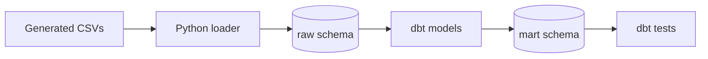

# dbt workflow

## What dbt is doing here

The Python loader creates the raw DuckDB tables. dbt then owns the SQL that turns those tables into the reporting models.

The database path is deliberately passed through `FINANCE_DUCKDB_PATH`. This matters because the loader and dbt must point to the same file; otherwise dbt can connect successfully but still report that the raw schema does not exist.



## Run sequence

From the repository root:

```bash
python -m pip install -e ".[dev]"
PYTHONPATH=src python -m finance_portfolio.generate_data
PYTHONPATH=src python -m finance_portfolio.load_duckdb
FINANCE_DUCKDB_PATH=data/finance.duckdb dbt debug --project-dir . --profiles-dir config
FINANCE_DUCKDB_PATH=data/finance.duckdb dbt build --project-dir . --profiles-dir config --target local --no-partial-parse
```

`dbt build` materialises the six mart models and runs the model tests and singular controls. The `--no-partial-parse` option is useful while changing the project because it makes the command parse the files currently on disk.

To generate the local documentation site:

```bash
FINANCE_DUCKDB_PATH=data/finance.duckdb dbt docs generate --project-dir . --profiles-dir config --target local --no-partial-parse
```

The generated `target/` directory is local output and is not committed.

## Models and checks

| Model | Grain | Main checks |
|---|---|---|
| `dim_customer` | One row per customer | Customer key not null and unique |
| `dim_loan` | One row per loan account | Account key not null and unique; customer relationship |
| `dim_subscription` | One row per subscription agreement | Subscription key, customer relationship, accepted values, chronology and row-count reconciliation |
| `fct_payment` | One row per payment | Payment key not null and unique; account relationship |
| `fct_subscription_payment` | One row per subscription billing attempt | Payment key, subscription relationship, accepted values, chronology, positive amount and collection reconciliation |
| `agg_subscription_monthly` | One row per month, product and billing frequency | Compound grain, metric consistency and reconciliation to the billing fact |

The singular test `reconcile_completed_payments` compares completed-payment totals in three places:

1. `raw.payments`
2. `mart.fct_payment`
3. The completed-payment summary in `mart.dim_loan`

This is a deliberately small control, but it reflects the type of check I would want before allowing a financial reporting model to be consumed.

`reconcile_subscription_row_count` confirms that the agreement-level mart has not silently lost or multiplied source rows. `subscription_start_not_after_as_of_date` prevents a future-starting agreement from appearing in a model described as being valid at the fixed run date.

`reconcile_subscription_collections` compares completed billing amounts in the raw event table with the fact table. The cancellation and billing-date tests also check that an active agreement has no cancellation date and that no attempt falls outside its agreement dates.

`reconcile_subscription_monthly` proves that the reporting aggregate preserves attempt counts and monetary totals from `fct_subscription_payment`. Separate controls test the compound grain and internal count/rate logic.

## Local setup decision

The profile is kept in `config/profiles.yml` rather than the default dbt user directory. That makes the project self-contained and avoids requiring a local profile to be created manually. It only contains a local DuckDB path and no credentials.

The schema-name macro keeps the output schema as `mart`. Without it, dbt would combine the target schema and custom schema, which would make the local database structure less obvious when comparing it with the architecture notes.
