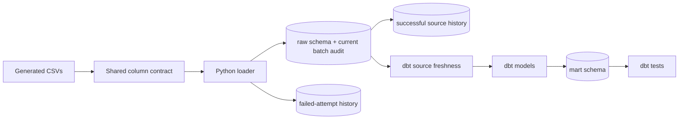

# dbt workflow

## What dbt is doing here

The Python loader creates the raw DuckDB tables. dbt then owns the SQL that turns those tables into the reporting models.

The database path is deliberately passed through `FINANCE_DUCKDB_PATH`. This matters because the loader and dbt must point to the same file; otherwise dbt can connect successfully but still report that the raw schema does not exist.


```mermaid
flowchart LR
    A[Generated CSVs] --> V[Shared column contract]
    V --> B[Python loader]
    B --> C[(raw schema + current batch audit)]
    C --> H[(successful source history)]
    B --> I[(failed-attempt history)]
    C --> G[dbt source freshness]
    G --> D[dbt models]
    D --> E[(mart schema)]
    E --> F[dbt tests]
```

## Run sequence

From the repository root:

```bash
python -m pip install -e ".[dev]"
PYTHONPATH=src python -m finance_portfolio.generate_data
PYTHONPATH=src python -m finance_portfolio.load_duckdb
FINANCE_DUCKDB_PATH=data/finance.duckdb dbt debug --project-dir . --profiles-dir config
FINANCE_DUCKDB_PATH=data/finance.duckdb dbt source freshness --project-dir . --profiles-dir config --target local --no-partial-parse
FINANCE_DUCKDB_PATH=data/finance.duckdb dbt build --project-dir . --profiles-dir config --target local --no-partial-parse
```

`dbt build` materialises the nine mart models and runs the model tests and singular controls. The `--no-partial-parse` option is useful while changing the project because it makes the command parse the files currently on disk.

`dbt source freshness` is a separate operational check. It runs after the raw load and before transformation. All nine raw sources, including the repayment schedule and ingestion audit, use the batch `loaded_at` timestamp rather than a business event date, with a one-hour warning and a 24-hour error threshold.

The local DuckDB target requests a forced checkpoint at the end of dbt commands. This was added after a completed build left a recovery file that conflicted with the next connection. The conflict has still recurred after later full builds, so the hook is treated as a mitigation rather than a guarantee. Controlled scenarios and documentation generation now use the same isolated-copy helper: it recognises only the specific duplicate-schema WAL replay error, copies the already checkpointed database file without deleting the recovery file, and re-raises unrelated catalogue errors. This is adapter-specific and does not represent a warehouse-wide production pattern.

To generate the local documentation site:

```bash
FINANCE_DUCKDB_PATH=data/finance.duckdb dbt docs generate --project-dir . --profiles-dir config --target local --no-partial-parse
```

The generated `target/` directory is local output and is not committed.

The source contract runs before the raw-table replacement. It belongs in Python rather than dbt because dbt starts after ingestion and should not be the first place a malformed input schema is discovered. dbt source and model tests remain responsible for the loaded relational data.

## Models and checks

| Model | Grain | Main checks |
|---|---|---|
| `dim_date` | One row per calendar date | Date/key uniqueness, valid attributes, configured bounds and uninterrupted daily sequence |
| `dim_customer` | One row per customer | Customer key not null and unique |
| `dim_loan` | One row per loan account | Account key not null and unique; customer relationship |
| `dim_subscription_plan` | One row per product and billing frequency | Plan key, compound grain, accepted values, positive amount and source reconciliation |
| `dim_subscription` | One row per subscription agreement | Subscription key, customer relationship, accepted values, chronology and row-count reconciliation |
| `fct_payment` | One row per payment | Payment key not null and unique; account relationship |
| `fct_loan_repayment_schedule` | One row per loan and scheduled instalment | Grain, sequence, due-date and full-principal reconciliation |
| `fct_loan_schedule_allocation` | One row per scheduled instalment | Oldest-first formula, future-row protection and account reconciliation |
| `fct_loan_schedule_position` | One row per loan at the fixed reporting date | Loan coverage, balance equations, proxy consistency and detail reconciliation |
| `agg_loan_portfolio_monthly` | One row per month end and loan product | Compound grain, population coverage, balance equations, weighted ratio and account-month reconciliation |
| `fct_subscription_payment` | One row per subscription billing attempt | Incremental merge key, source-batch timestamp, subscription relationship, accepted values, chronology, positive amount and collection reconciliation |
| `agg_subscription_monthly` | One row per eligible month, product and billing frequency | Active-plan coverage, compound grain, zero handling, metric consistency and fact reconciliation |
| `agg_subscription_movement_monthly` | One row per month, product and billing frequency | Complete month coverage, movement equation, roll-forward and agreement reconciliation |

The singular test `reconcile_completed_payments` compares completed-payment totals in three places:

1. `raw.payments`
2. `mart.fct_payment`
3. The completed-payment summary in `mart.dim_loan`

This is a deliberately small control, but it reflects the type of check I would want before allowing a financial reporting model to be consumed.

`reconcile_subscription_row_count` confirms that the agreement-level mart has not silently lost or multiplied source rows. `subscription_start_not_after_as_of_date` prevents a future-starting agreement from appearing in a model described as being valid at the fixed run date.

`reconcile_subscription_collections` compares completed billing amounts in the raw event table with the fact table. The cancellation and billing-date tests also check that an active agreement has no cancellation date and that no attempt falls outside its agreement dates.

`reconcile_subscription_monthly` proves that the reporting aggregate preserves attempt counts and monetary totals from `fct_subscription_payment`. Separate controls test the compound grain and internal count/rate logic.

`date_dimension_bounds` checks the configured start, fixed end and expected number of dates. `date_dimension_continuity` uses the previous date in sequence to detect gaps inside those bounds. Billing fact and monthly aggregate relationship tests confirm that both daily and month-start dates resolve to the calendar.

`subscription_agreement_matches_plan` checks that the product and billing frequency retained on each agreement agree with its referenced plan. `subscription_payment_matches_plan_amount` follows the agreement-to-plan relationship and rejects billing attempts with a different amount.

`subscription_monthly_active_plan_coverage` independently rebuilds the agreement-overlap population and compares both its keys and active-agreement counts with the monthly mart. The metric-consistency control separately verifies that zero-attempt rows contain zero counts, amounts and collection rate.

`reconcile_subscription_movements` confirms that starts and cancellations appear once in the movement series. Separate controls prove the month-plan grain, complete calendar coverage, within-month movement equation and closing-to-next-opening roll-forward.

`reconcile_ingestion_audit` independently compares every audit row with the physical raw table count. Source tests also require one audit row per source name, a batch identifier, timestamp and `Loaded` status. Python performs the same count checks before committing the transaction, so an incomplete batch is rejected before dbt begins.

The `audit` source exposes run, source and failure history without applying freshness rules to old records. `ingestion_history_consistency` requires a successful run to reconcile to eight source rows and requires a failed run to have zero accepted sources. `ingestion_failure_consistency` checks that every failed run has one failure detail, successful runs have none, and failure timestamps and messages are valid. `current_ingestion_matches_history` confirms the current raw manifest still agrees with its successful history record, including file size and SHA-256 digest. `ingestion_audit_file_metadata` requires valid fingerprints for the seven accepted CSV sources and NULL file metadata for generated run parameters.

The subscription plan snapshot runs as part of `dbt build`. It uses the check
strategy because the synthetic source does not provide an update timestamp. Three
singular controls require one current row per plan, reject invalid or overlapping
validity windows, and reconcile the current version back to the source.

`make snapshot-history-check` performs a separate change scenario against a
temporary database copy. It is intentionally outside the main data build so proof of
versioning does not alter the clean seed-42 reporting output.

The agreement snapshot applies the same observation-time approach to current
subscription rows. Its tests require one current version per agreement, valid
non-overlapping windows, consistent status and cancellation fields, and exact
reconciliation of the current snapshot to the current source.

Both controlled scenarios use a shared Python helper. Each starts from a checkpointed
copy of the clean database, changes one synthetic row and reruns the snapshots. This
keeps the evidence repeatable without contaminating the normal seed-42 output.

The status-change fact depends on the agreement snapshot through `ref`, so dbt
builds the snapshot before the downstream model. Its reconciliation test derives the
expected transitions independently from the full history and compares their version
IDs with the fact.

After the controlled cancellation updates the temporary source and reruns snapshots,
the Python scenario runs a selected dbt build for
`fct_subscription_status_change`. That selected build executes the model and its
eleven attached data tests before Python checks the resulting transition.

The source-removal scenario deletes one active agreement from a temporary raw table,
reruns snapshots and builds `fct_subscription_source_removal` with its select…4575 tokens truncated… byte size and SHA-256 fingerprint.

| Check | Result |
|---|---:|
| Current source audit rows | 7 / 7 |
| Successful run history rows | 1 |
| Source history rows | 7 |
| CSV files with valid fingerprints | 6 / 6 |
| Fresh raw sources | 8 / 8 |
| Declared dbt sources | 10 |
| dbt table models | 9 passed |
| dbt data tests | 151 passed |
| dbt model and data-test resources | 160 passed |
| DuckDB checkpoint hook | Passed |
| Python tests | 17 passed |
| Ruff | Passed |

A two-run Python test produced two distinct batch IDs and fourteen source-history rows. Because the input files were unchanged, the customer source retained one distinct SHA-256 digest. The existing missing-file test also confirmed that a failed replacement did not add a second success record.

For a controlled history failure, I replaced the persisted payment digest with a different valid 64-character value while leaving the current manifest unchanged. `current_ingestion_matches_history` returned exactly one row and dbt exited with code 1. I then recreated the database and reran the clean pipeline.

## Failed-attempt history run — 12 September 2026

The loader now preserves a rejected attempt after rolling back the transaction that replaces the raw data.

| Check | Result |
|---|---:|
| Successful / failed run history rows | 1 / 1 |
| Accepted source-history rows | 7 |
| Failure-detail rows | 1 |
| Raw payment rows retained after failure | 99 |
| Fresh raw sources on clean run | 8 / 8 |
| Declared dbt sources | 11 |
| dbt table models | 9 passed |
| dbt data tests | 158 passed |
| dbt model and data-test resources | 167 passed |
| DuckDB checkpoint hook | Passed |
| Python tests | 18 passed |
| Ruff | Passed |

I removed `payments.csv` after a valid load and reran ingestion. The second command exited with code 1. The database retained the previous 99 payment rows and seven accepted source records, while the control history added one `Failed` run and one `FileNotFoundError` detail. The stored message was `Required source file not found: payments.csv`, without the local path. All three ingestion-history reconciliation tests passed against this mixed success/failure history.

For a controlled audit failure, I removed the temporary failure-detail row but left its `Failed` run header. `ingestion_failure_consistency` returned exactly one result and dbt exited with code 1. I then recreated the generated files and database before the final clean run.

An earlier attempt to run this scenario immediately after the full dbt build encountered the documented DuckDB write-ahead-log replay conflict before the loader reached the missing file. I did not count that as failure-history evidence. Repeating the scenario on a freshly loaded database isolated the loader behaviour and produced the expected result.

## Source-contract run — 13 September 2026

The generator and loader now use one executable definition for the six CSV column sets and their DuckDB types.

| Check | Result |
|---|---:|
| Contracted CSV sources | 6 / 6 |
| Fresh raw sources | 8 / 8 |
| dbt table models | 9 passed |
| dbt data tests | 158 passed |
| dbt model and data-test resources | 167 passed |
| DuckDB checkpoint hook | Passed |
| Python tests | 20 passed |
| Ruff | Passed |

For a controlled schema-drift failure, I renamed the temporary `customers.csv` header from `postcode` to `email`. The second load exited non-zero with one `SourceContractError` identifying the missing and unexpected columns. The previous 25-customer raw table remained current, and the rejected attempt appeared once in failure history.

A separate test writes the customer columns in reverse order and loads all five test customers successfully. This confirms that the contract is based on column identity rather than file position. Missing, unexpected and duplicate column names are rejected.

## Subscription plan history run — 14 September 2026

The clean seed-42 pipeline created one current snapshot version for each of the four
subscription plans. The existing reporting totals did not change.

| Check | Result |
|---|---:|
| dbt table models | 9 passed |
| dbt snapshots | 1 passed |
| Clean current / closed plan versions | 4 / 0 |
| dbt data tests | 170 passed |
| Model, snapshot and data-test resources | 180 passed |
| DuckDB checkpoint hook | Passed |
| Total dbt results including hook | 181 passed |
| Raw sources within freshness threshold | 8 of 8 |
| Python tests | 20 passed |
| Ruff | Passed |
| GitHub Actions | Passed |

The controlled scenario copied the built database, increased
`SUB-1-MONTHLY` by £0.01 and ran the snapshot again. It produced five total
versions: four current rows and one closed row. The copied database was then
discarded.

The first CI attempt exposed a wrong assumption in the helper: I used a
`PLAN-` prefix that does not exist in the generated key. The clean dbt build had
already passed, but the scenario stopped before making a change. After correcting
the key to `SUB-1-MONTHLY`, the complete workflow passed. This failure remains
visible in the pull-request checks.

## Subscription agreement history run — 15 September 2026

The clean pipeline created one current snapshot version for each of the 20 synthetic
agreements. No reporting totals changed.

| Check | Result |
|---|---:|
| dbt table models | 9 passed |
| dbt snapshots | 2 passed |
| Clean current / closed agreement versions | 20 / 0 |
| dbt data tests | 187 passed |
| Model, snapshot and data-test resources | 198 passed |
| DuckDB checkpoint hook | Passed |
| Total dbt results including hook | 199 passed |
| Raw sources within freshness threshold | 8 of 8 |
| Python tests | 20 passed |
| Ruff | Passed |
| GitHub Actions | Passed |

The controlled agreement scenario selected the first active agreement, changed its
status to Cancelled and set its synthetic cancellation event date to the fixed
reporting date. The temporary database then contained 21 agreement versions: 20
current rows and one closed row. The existing plan-change scenario also passed with
five plan versions, four current and one closed.

The common checkpoint, temporary-copy and dbt subprocess logic was moved into one
helper and exercised by both scenarios.

## Observed subscription status-change run — 16 September 2026

The clean seed-42 build contains zero status-change facts. This is expected because
the first snapshot contains no prior version to compare.

| Check | Result |
|---|---:|
| dbt table models | 10 passed |
| dbt snapshots | 2 passed |
| Clean observed status-change rows | 0 |
| dbt data tests | 198 passed |
| Model, snapshot and data-test resources | 210 passed |
| DuckDB checkpoint hook | Passed |
| Total dbt results including hook | 211 passed |
| Raw sources within freshness threshold | 8 of 8 |
| Python tests | 20 passed |
| Ruff | Passed |
| GitHub Actions | Passed |

The controlled agreement scenario reran the snapshots after changing one Active
agreement to Cancelled, then rebuilt the status-change fact with eleven selected
tests. It produced exactly one transition with the expected agreement ID,
Active-to-Cancelled statuses, cancellation event date, observation timestamp and
calculated day difference. The plan scenario remained green.

## Subscription source-removal run — 17 September 2026

The clean seed-42 build contains zero removal rows.

| Check | Result |
|---|---:|
| dbt table models | 11 passed |
| dbt snapshots | 2 passed |
| Clean source-removal rows | 0 |
| dbt data tests | 209 passed |
| Model, snapshot and data-test resources | 222 passed |
| DuckDB checkpoint hook | Passed |
| Total dbt results including hook | 223 passed |
| Raw sources within freshness threshold | 8 of 8 |
| Python tests | 20 passed |
| Ruff | Passed |
| GitHub Actions | Passed |

The controlled scenario removed one active agreement from a temporary raw table. The
snapshot retained 20 historical versions, closed the removed agreement and left 19
current versions. The selected removal model and ten attached tests passed, producing
one removal row whose last observed status remained Active and whose cancellation
flag remained false. The plan-change and status-change scenarios also remained green.

## Unified subscription history event run — 18 September 2026

The clean seed-42 build contains no historical events because it has only initial snapshot states. The unified fact remains empty rather than manufacturing transitions.

| Check | Result |
|---|---:|
| dbt table models | 12 passed |
| dbt snapshots | 2 passed |
| Clean unified history-event rows | 0 |
| dbt data tests | 221 passed |
| Model, snapshot and data-test resources | 235 passed |
| DuckDB checkpoint hook | Passed |
| Total dbt results including hook | 236 passed |
| Raw sources within freshness threshold | 8 of 8 |
| Python tests | 20 passed |
| Ruff | Passed |
| GitHub Actions | Passed |

The controlled cancellation scenario produced one component status change and one unified `Status Change` event. The controlled removal scenario produced one component source removal and one unified `Source Removal` event. In each scenario, the selected unified build passed 14 of 14 results: one model, twelve attached tests and the checkpoint hook.

The first integrated CI attempt exposed a dependency-ordering problem rather than a data-model defect. `dbt build --select fct_subscription_status_change` eagerly selected a downstream reconciliation test while `fct_subscription_history_event` still held the prior clean state. The scenario now runs the component model first and then builds and tests the unified consumer. The corrected complete workflow passed, while the failed run remains visible in the pull-request history.

## Incremental subscription-payment run — 19 September 2026

The clean seed-42 build keeps the same 150 subscription billing attempts and
£3,648.00 of completed collections.

| Check | Result |
|---|---:|
| dbt table models | 11 passed |
| dbt incremental models | 1 passed |
| dbt snapshots | 2 passed |
| dbt data tests | 222 passed |
| Model, snapshot and data-test resources | 236 passed |
| DuckDB checkpoint hook | Passed |
| Total dbt results including hook | 237 passed |
| Raw sources within freshness threshold | 8 of 8 |
| Python tests | 20 passed |
| Ruff | Passed |
| dbt documentation | Generated |

The isolated incremental scenario first reran unchanged input and remained at 150
rows and 150 distinct keys. It then corrected one existing Failed attempt to
Completed and inserted one late Failed retry. The selected fact-and-descendant build
finished 36 of 36 results, producing 151 rows, 151 distinct keys and one additional
collected attempt. A second rerun also passed 36 of 36 and retained the same state.

The first scenario attempt encountered the project's known local DuckDB recovery-file
conflict before any incremental assertion ran, so it is not counted as evidence. A
later attempt proved the merge but selected only the fact; dbt then ran the downstream
monthly reconciliation while the aggregate still represented the baseline. The
scenario now selects `fct_subscription_payment+` so the aggregate and its tests are
refreshed in the same dependency boundary.

## Incremental source-absence run — 20 September 2026

The clean seed-42 output remains unchanged: 150 physical payment rows, all 150
present in the current source and zero absence flags.

| Check | Result |
|---|---:|
| dbt table models | 11 passed |
| dbt incremental models | 1 passed |
| dbt snapshots | 2 passed |
| dbt data tests | 224 passed |
| Model, snapshot and data-test resources | 238 passed |
| DuckDB checkpoint hook | Passed |
| Total dbt results including hook | 239 passed |
| Raw sources within freshness threshold | 8 of 8 |
| Python tests | 20 passed |
| Ruff | Passed |
| dbt documentation | Generated |

The expanded isolated scenario ran six selected fact-and-descendant builds, each
passing 38 of 38 results. After the existing insert and correction steps, removing
one completed source payment left 151 physical and distinct fact keys, 150 current
keys and one absent key with `source_missing_since` populated. Current monthly
attempts also reconciled to 150. Restoring the source row returned all 151 keys to
current reporting, cleared the absence metadata and stayed stable on the final
rerun.

The first scenario attempt encountered the known DuckDB recovery-file replay issue
before assertions and is excluded from the evidence. The recovery file was retained
separately and the checkpointed database passed the complete scenario. No model or
test change was needed after the successful full build.

## Incremental run-audit evidence — 21 September 2026

The clean seed-42 build appends one reconciled transformation-run row. The underlying
payment output remains 150 current rows and £3,648.00 collected.

| Check | Result |
|---|---:|
| dbt table models | 11 passed |
| dbt incremental models | 2 passed |
| dbt snapshots | 2 passed |
| Clean transformation-audit rows | 1 reconciled |
| dbt data tests | 235 passed |
| Model, snapshot and data-test resources | 250 passed |
| DuckDB checkpoint hook | Passed |
| Total dbt results including hook | 251 passed |
| Raw sources within freshness threshold | 8 of 8 |
| Python tests | 20 passed |
| Ruff | Passed |
| dbt documentation | Generated |

The isolated incremental scenario again ran six selected builds. Each passed 50 of
50 results and appended one unique run record. The records covered the unchanged
baseline, insert-and-correction state, unchanged rerun, one retained absent key,
restoration and final unchanged rerun. Every row reconciled raw to current fact
counts and collections; physical fact rows reconciled to current plus absent rows.

The first local scenario launch encountered the known DuckDB recovery-file replay
conflict before any Day 28 assertion ran. I preserved that file outside the
repository and reran the six-state scenario from the checkpointed database. The
setup failure is not counted as control evidence.

## Consecutive payment-run differences — 22 September 2026

The clean seed-42 build has one audited payment run. Its comparison view has one
row, with null predecessor and null differences rather than an invented baseline.

| Check | Result |
|---|---:|
| dbt table / incremental / view models | 11 / 2 / 1 passed |
| dbt snapshots | 2 passed |
| dbt data tests | 239 passed |
| Model, snapshot and data-test resources | 255 passed |
| DuckDB checkpoint hook | Passed |
| Total dbt results including hook | 256 passed |
| Raw sources within freshness threshold | 8 of 8 |
| Python tests | 20 passed |
| Ruff | Passed |
| dbt documentation | Generated |

All six selected incremental builds passed 55 of 55 results. The comparison view
reported zero differences on three unchanged reruns. The insert-and-correction
run increased raw, physical and current counts by one and completed collections
by one. Removing one completed source row decreased raw and current counts by one
while leaving physical count unchanged and raising retained-absent count by one.
Restoring it reversed those movements. The controlled checks also compared the
collection-amount deltas to the actual synthetic payment amounts.

The first local scenario attempt used a custom database basename, while the shared
copy helper renamed it to `finance.duckdb`. The persisted view referred to the
original catalogue, so the comparison query failed before assertions. The helper
now preserves the source basename; the rerun and older history scenarios passed.

## Unified milestone quality gate — 23 September 2026

`make verify` now defines the complete local and CI merge gate. A clean Day 30
database passed the full sequence in one command:

- 8 of 8 source-freshness checks;
- 256 of 256 clean dbt results;
- plan, agreement and source-removal history scenarios;
- six incremental payment builds at 55 of 55 results each;
- 20 Python tests and Ruff; and
- dbt catalogue generation.

The first local invocation stopped before loading because the fresh execution
environment did not have the package dependencies installed. After running the
documented `python -m pip install -e ".[dev]"` prerequisite, the complete gate
passed. That setup stop did not execute project logic and is not counted as
validation evidence.

## Known gaps

- The freshness timestamp begins at the local DuckDB load; it cannot prove when an upstream system extracted or published the data.
- The history has no upstream extraction identifier and is stored in the same local database rather than an immutable control store.
- Failed attempts retain run-level error detail but no source-level history, retries or alerts.
- Empty raw sources are currently rejected; there is no source-specific policy for a legitimate zero-row extract.
- The column contract is not versioned and does not yet declare nullability or compatibility rules for schema changes.
- One payment fact now uses a keyed incremental merge. The other marts rebuild as tables, and the full-refresh raw load means the incremental fact still considers the complete source.
- Source absence is inferred from a complete local snapshot. There is no upstream deletion event or reason code, so an omitted row and a genuine deletion cannot be distinguished.
- Transformation-run evidence shares the local database, runs only when its model is selected and has no external alerting or immutable control store. Its metrics describe resulting state rather than a row-level change set.
- Consecutive-run differences are net movements. Equal totals can conceal offsetting corrections, and no source change reason is inferred from a delta.
- Subscription refunds, billing retries and revenue-recognition rules are not yet represented. Plan and agreement changes are retained only from the point the local snapshots begin.
- The plan snapshot records observation time, not a contractual business-effective date; it cannot reconstruct changes from before the first snapshot run.
- Agreement snapshots retain observed changes, but there is still no source event stream for pauses, reactivations or retroactive corrections. A source removal has no upstream reason code, so omission, retention and genuine deletion cannot be distinguished.
- The calendar start date is a project variable rather than source-system metadata.
- The current dataset is intentionally small; scale and performance behaviour have not been tested.

## Month-end loan snapshot — 24 September 2026

The seed-42 dataset produced 355 month-end rows across all 25 loan accounts, from
31 January 2024 to 31 December 2025. Completed payment amounts summed once across
the monthly movements to £6,025.00. The final snapshots produced a £62,325.00
calculated remaining balance and no payments above original balance.

The clean build and final shared quality gate passed:

- 8 of 8 source-freshness checks;
- 12 table models, 2 incremental models, 1 view and 2 snapshots;
- 259 dbt data tests;
- 277 of 277 total dbt results including the checkpoint hook;
- complete eligible loan-month coverage and unique compound grain;
- payment roll-forward and final-snapshot reconciliation; and
- the existing subscription, history and ingestion controls;
- all four controlled change scenarios;
- 22 Python tests and Ruff; and
- dbt documentation generation.

The fresh execution environment initially lacked the declared Python packages, so
the first command stopped before loading or testing project data. After installing
the documented development dependencies, the build passed. A separate read-only
inspection encountered the documented DuckDB WAL replay conflict; copying the
checkpointed database without the recovery file allowed result inspection. The
same condition then stopped the first full gate before its history scenarios. I
added a narrow fallback that recognises only this duplicate-schema replay error,
copies the checkpointed database for isolated scenarios, leaves the recovery file
untouched and re-raises unrelated catalogue errors. Two Python tests cover both
paths. The complete `make verify` rerun then passed. The setup stops are not counted
as model-control evidence.

## Loan repayment schedule — 25 September 2026

The seed-42 dataset produced 294 scheduled principal instalments across 25 loans.
The 6-, 12- and 18-month terms were represented by 9, 8 and 8 accounts
respectively. Scheduled principal totalled £68,350.00 and reconciled exactly to
the original loan balances.

The clean build passed:

- 9 of 9 source-freshness checks;
- 13 table models, 2 incremental models, 1 view and 2 snapshots;
- 275 dbt data tests;
- 294 of 294 total dbt results including the checkpoint hook;
- schedule key, account relationship, sequence, calendar-date and positive-amount controls;
- exact schedule-to-original-balance reconciliation;
- 24 Python tests and Ruff; and
- dbt documentation generation.

The first dbt attempt returned one ingestion-audit reconciliation exception because
that SQL control still enumerated the pre-schedule sources. I added the new
schedule source to the test and rebuilt a fresh database; the final clean build
passed. This was an integration omission in the change, not controlled failure
evidence.

For the controlled failure, I increased one scheduled principal amount by £0.01 in
an isolated database. `reconcile_loan_repayment_schedule` returned exactly one
failing account. The clean database and generated source were unchanged.

## Loan schedule allocation — 26 September 2026

The allocation fact retained all 294 scheduled instalments. At the fixed reporting
date, 236 instalments representing £57,712.01 of principal were due and 58
instalments representing £10,637.99 remained future. The model allocated all
£6,025.00 of completed payments to due principal under the stated oldest-first
assumption, leaving £51,687.01 uncovered.

The clean build passed:

- 9 of 9 source-freshness checks;
- 14 table models, 2 incremental models, 1 view and 2 snapshots;
- 294 dbt data tests;
- 314 of 314 total dbt results including the checkpoint hook;
- schedule-row, relationship, allocation-formula, future-row and account-level reconciliation controls;
- 25 Python tests and Ruff; and
- dbt documentation generation.

The first complete local gate reached documentation generation after the models,
tests and controlled scenarios had passed, then encountered the known DuckDB
duplicate-schema recovery-file replay error. I changed the documentation command to
use the same checkpointed temporary-copy helper as the controlled scenarios. The
helper handles only that exact replay signature, leaves the recovery file in place
for diagnosis and re-raises unrelated catalogue errors. The repeated full gate then
passed, including catalogue generation.

For a controlled failure, I increased one allocated amount by £0.01 in a disposable
database. `reconcile_loan_schedule_allocation` returned exactly one failing account
and dbt exited with code 1. The clean database was unchanged.

I also tested the opposite boundary in another disposable database. One completed
payment was increased so its account had £100,000.00 completed against £1,566.60
due. All 19 selected allocation tests passed: the model allocated £1,566.60, left
£98,433.40 unallocated and assigned £0.00 to future instalments. This proves the
declared cap; it does not establish that a real lender would use this allocation
order.

## Account schedule position — 27 September 2026

The account summary produced 25 rows, one for every loan. Under the principal-only
project assumptions, all 25 accounts were `Behind Schedule`: £57,712.01 was due,
£6,025.00 was allocated and £51,687.01 remained uncovered. The average account
coverage ratio was 0.1644, with 207 uncovered instalments. The oldest uncovered due
date was 22 March 2024 and the largest days-past-due proxy was 649 days.

These figures expose the sparse generated payment pattern; they are not presented
as a realistic credit portfolio result.

The clean quality gate passed:

- 9 of 9 source-freshness checks;
- 15 table models, 2 incremental models, 1 view and 2 snapshots;
- 321 dbt data tests;
- 342 of 342 dbt results including the checkpoint hook;
- account coverage, money-equation, proxy-consistency and detail-reconciliation controls;
- all four controlled history and incremental scenarios;
- 25 Python tests and Ruff; and
- dbt documentation generation.

For a controlled failure, I increased one account summary's shortfall by £0.01 in
a disposable database. `reconcile_loan_schedule_position` returned exactly one
failure and dbt exited with code 1.

For the opposite boundary, I increased one completed payment in another disposable
database, refreshed the four affected models and ran all 28 position-focused tests.
The account had £4,000.00 due and allocated, zero shortfall, zero days proxy and
£96,075.00 unallocated cash. Its status changed to `On Schedule`, and every selected
test passed.

The fresh execution environment initially lacked the declared dependencies, so the
first load stopped before model execution. A narrow exploratory selection later
ran shared tests without building their unrelated parent models, and the first
covered-account scenario refreshed a producer while leaving an existing consumer
stale. Neither stop is treated as data-quality evidence. The documented dependency
install, full quality gate and corrected disposable scenario all completed
successfully.

## Monthly loan portfolio reporting — 28 September 2026

The monthly product mart produced 65 rows across 24 month ends and three products.
Products enter the series only after their first related loan originates. At 31
December 2025, the three rows reconciled to 25 accounts, £68,350.00 original
principal, £57,712.01 due, £6,025.00 assumed allocation, £51,687.01 shortfall and
£10,637.99 future principal. The portfolio-weighted due-principal coverage ratio
was 0.1044.

The clean quality gate passed:

- 9 of 9 source-freshness checks;
- 16 table models, 2 incremental models, 1 view and 2 snapshots;
- 339 dbt data tests;
- 361 of 361 dbt results including the checkpoint hook;
- all four controlled history and incremental scenarios;
- six incremental payment runs at 55 of 55 results each;
- 25 Python tests and Ruff; and
- dbt documentation generation.

For a controlled failure, I increased one December product shortfall by £0.01 in
an isolated database. `reconcile_loan_portfolio_monthly` returned exactly one
failure and dbt exited with code 1. The clean source database was unchanged.

A narrow exploratory build also selected shared tests whose unrelated parent
models had not been built in that disposable database. Those catalogue errors are
not treated as quality evidence; the new aggregate's focused checks and the full
project gate both passed.

## Local pipeline orchestration — 29 September 2026

The Day 36 runner completed generation, ingestion, source freshness and the full
dbt build in dependency order. Its JSON result recorded four successful stages
with zero return codes. The clean shared quality gate passed:

- 9 of 9 source-freshness checks;
- 339 dbt data tests and 361 of 361 total dbt results;
- all four controlled historical and incremental scenarios;
- six incremental payment builds at 55 of 55 results each;
- 29 Python tests;
- Ruff; and
- dbt documentation generation.

A genuine rerun against a reused disposable database reached the known DuckDB WAL
replay conflict during ingestion. The run report retained the exact propagation:
`generate` succeeded, `load` failed with return code 1, and `source_freshness` plus
`dbt_build` were blocked and never attempted. A fresh database then passed the
complete gate. This proves local stop-on-failure behaviour; it does not resolve the
underlying DuckDB recovery-file limitation.

The first local gate also showed that dbt's anonymous-usage opt-out had only been
set in GitHub Actions and the runner's dbt stages. The Makefile now exports the
opt-out to every scenario and documentation subprocess as well.

## Pipeline concurrency lock — 30 September 2026

Day 37 adds an atomic lock before the first pipeline stage. A controlled command-
line overlap test held the lock under `controlled-owner`, attempted a second real
runner invocation and received exit code 2. The rejected invocation did not create
or open its target DuckDB database.

The focused runner suite passed eight tests. These cover dependency execution,
failure blocking, invalid dependency graphs, database configuration, lock
contention, release after success, release after an exception and owner-aware
cleanup. The full clean quality gate then passed:

- 9 of 9 source-freshness checks;
- 339 dbt data tests and 361 of 361 total dbt results;
- all four controlled historical and incremental scenarios;
- six incremental payment builds at 55 of 55 results each;
- 33 Python tests;
- Ruff; and
- dbt documentation generation.

The successful run removed its lock and retained a four-stage successful JSON
report. Stale-lock deletion is not automated: process age alone is not enough to
prove that a run is dead, and a false decision could reintroduce concurrent writes.

## Complete verification boundary — 1 October 2026

Day 38 closes the gap between the four-stage pipeline lock and the remaining
verification commands. An overlap attempt during the incremental scenario was
rejected before any stage or second report was created. The focused runner suite
passed 9 tests; the complete finance suite passed 34 Python tests, 9 freshness
checks, 339 dbt data tests and 361 total dbt results, all historical/incremental
scenarios, Ruff and documentation. A second full gate with an explicit diagnostic
lock also checked its release in the same shell. GitHub Actions now checks the
default lock is absent after verification.


## Day 39 — completed-run evidence

The full 11-stage `make verify` gate passed: 9/9 source freshness checks, 361/361 dbt results (339 data tests), all history and incremental scenarios, Ruff, documentation and 36 Python tests. The runner's archived JSON exactly matched its latest report. Two new tests retain success and failure evidence and reject archive collisions without replacing the previous report.
